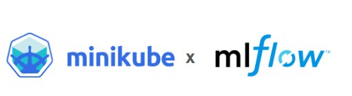

# Kubeflow Pipelines with Minikube and MLflow Integration


A guide to setting up Kubeflow Pipelines with Minikube and MLflow integration for machine learning workflows.



## Setup & Installation

### 1. Docker Desktop Configuration
1. Install [Docker Desktop](https://www.docker.com/products/docker-desktop)
2. Enable WSL Integration:
   - Open Docker Desktop Settings
   - Navigate to **Resources > WSL Integration**
   - Enable integration with your Ubuntu/WSL distribution
   - Restart Docker Desktop

### 2. Minikube Installation
1. Install [Minikube for Windows](https://minikube.sigs.k8s.io/docs/start/)
2. Start Minikube cluster:
   ```bash
   minikube start --driver=docker
   minikube status  # Verify cluster status

### 3. Kubeflow Pipelines Deployment
1. Apply cluster-scoped resources:
   ```bash
   kubectl apply -k "github.com/kubeflow/pipelines/manifests/kustomize/cluster-scoped-resources?ref=1.8.0"
   ```
2. Deploy platform-agnostic components:
   ```bash
   kubectl apply -k "github.com/kubeflow/pipelines/manifests/kustomize/env/platform-agnostic?ref=1.8.0" -n kubeflow
   ```
3. Verify deployment (allow 5 minutes for pods initialization):
   ```bash
   kubectl get pods -n kubeflow -w
   ```

### 4. Environment Setup
1. Install required Python packages:
   ```bash
   pip install -r requirements.txt
   ```
---

## Running the Pipeline

### 1. Start MLflow Tracking Server
```bash
mlflow server \
  --backend-store-uri sqlite:///mlflow.db \
  --default-artifact-root ./mlruns \
  --host 0.0.0.0 \
  --port 5000
```
Open browser: http://localhost:5000

### 2. Upload and Execute Pipeline
1. Compile and upload the pipeline(the .yaml file it will produce):
   ```bash
   python mlflow_pipeline.py
   ```
2. Access Kubeflow Dashboard:
   ```bash
   kubectl port-forward svc/ml-pipeline-ui 8080:80 -n kubeflow
   ```
   Open browser: http://localhost:8080


3. UI Workflow:
   - Click **Upload Pipeline**
   - Select `mlflow_pipeline.yaml` (fill the details and click Create)
   - Create a new experiment with the pipeline create
   - Start pipeline run

---

## Monitoring & Verification

### Kubeflow Dashboard
- Real-time pipeline execution tracking
- Component status monitoring
- Artifact visualization

### MLflow Tracking
MLflow UI:
- View experiment parameters
- Track metrics (e.g., accuracy=0.95)
- Analyze artifacts

### Cluster Status Checks
```bash
kubectl get pods -n kubeflow  # Pipeline components
minikube service list         # Active services
```

---


💡 **Optimization**:
- Allocate more resources: `minikube start --driver=docker --memory=8192 --cpus=4`
